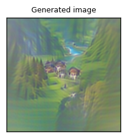
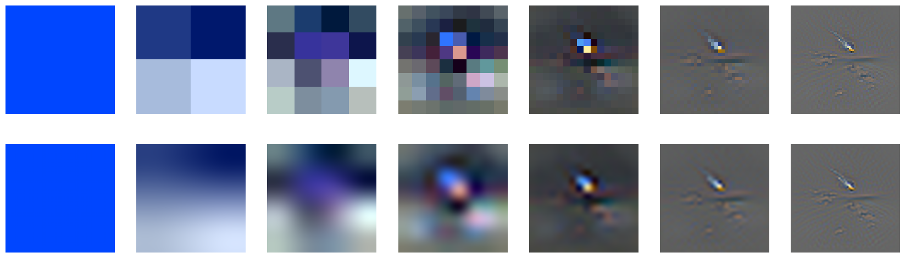
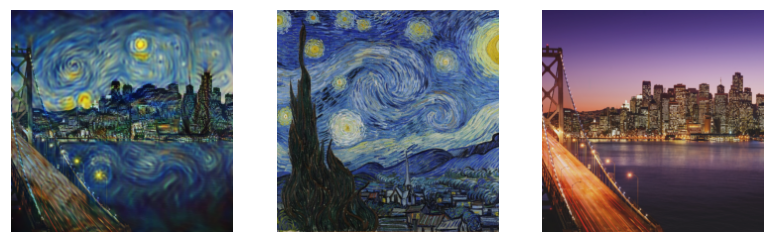
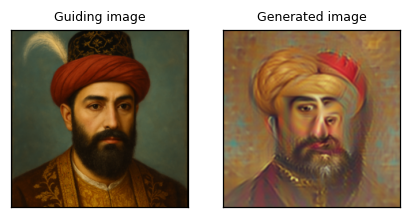
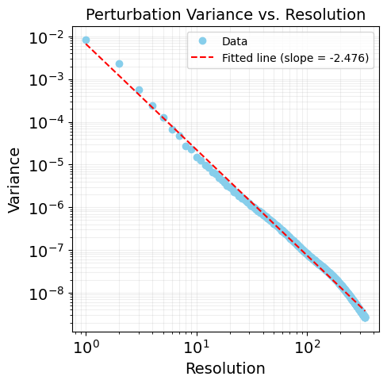

# Direct Ascent Synthesis: Hidden Generative Capabilities in Discriminative Models
A demo for the Direct Ascent Synthesis: Hidden Generative Capabilities in Discriminative Models paper (https://arxiv.org/abs/2502.07753)

[This Colab](https://github.com/stanislavfort/Direct_Ascent_Synthesis/blob/main/Direct_Ascent_Synthesis_generation_demo.ipynb) demonstrates
1. Text to image generation
2. "Style" transfer
3. Image reconstruction from its CLIP embedding

What you can expect:
1. Text to image generation for `a photo of a meteor streaking through the night sky, detailed` looking like this
   
2. Its individual resolutions looking like this after generation:
   
3. To showcase generation diversity, 4 generations of the `a beautiful photo of Antelope Canyon’s light beams, detailed`
   
4. Combining a source image of an SF skyline at night with the Van Gogh "The Starry Night"
   
5. And finally reconstructing an image of Henry VIII from its CLIP embedding:
   
6. Get a spectrum of a generated image:
   

If you find this useful and would you like to cite us, please use the following bibtex

```
@misc{fort2025directascentsynthesisrevealing,
      title={Direct Ascent Synthesis: Revealing Hidden Generative Capabilities in Discriminative Models}, 
      author={Stanislav Fort and Jonathan Whitaker},
      year={2025},
      eprint={2502.07753},
      archivePrefix={arXiv},
      primaryClass={cs.CV},
      url={https://arxiv.org/abs/2502.07753}, 
}
```
