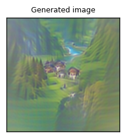
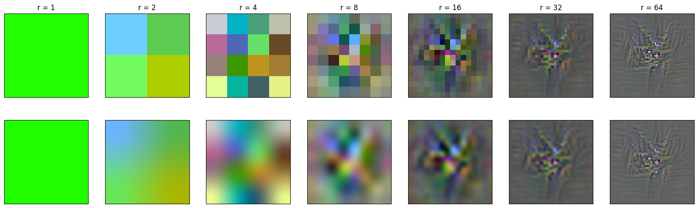
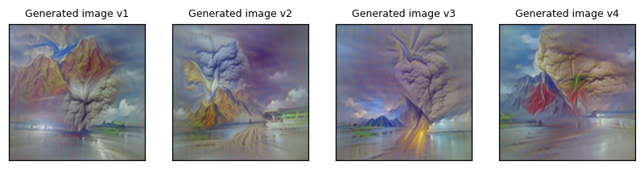
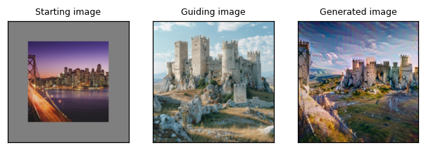
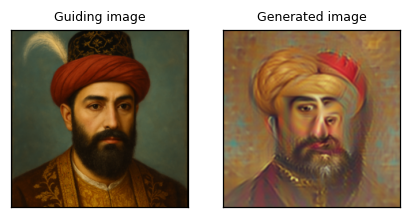
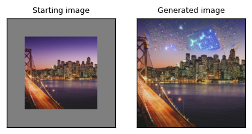

# Direct Ascent Synthesis: Revealing Hidden Generative Capabilities in Discriminative Models
A cleaned and improved version of the original demo for the Direct Ascent Synthesis: Revealing Hidden Generative Capabilities in Discriminative Models paper (https://arxiv.org/abs/2502.07753)

[This notebook](https://github.com/MehdiJmlkh/Direct-Ascent-Synthesis/blob/main/Direct-Ascent-Synthesis-generation-demo.ipynb) demonstrates
1. Text to image generation
2. "Style" transfer
3. Image reconstruction from its CLIP embedding

What you can expect:
1. Text to image generation for `a photo of swiss mountain valley` looking like this:

   

2. Its individual resolutions looking like this after generation:

   

3. To showcase generation diversity, 4 generations of the `a beautiful photo of  Mount Pinatubo eruption., detailed`:

   

4. Combining a source image of an SF skyline at night with a medieval fortress:

   

5. Reconstructing an image from its CLIP embedding:

   

6. And finally inpainting for `a vast night sky filled with countless twinkling stars` looking like this:

   

